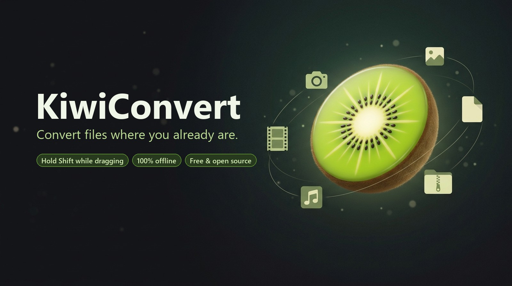

<p align="center">
  
</p>

<p align="center">
  <b>Hold <kbd>Shift</kbd> while you drag a file in File Explorer. A wheel of formats opens around your pointer. Drop the file on one and the converted copy lands next to the original.</b>
</p>

<p align="center">
  <a href="https://github.com/jherobred/KiwiConvert/releases/latest">Download</a> ·
  <a href="#what-it-does">What it does</a> ·
  <a href="#build-from-source">Build from source</a> ·
  <a href="CONTRIBUTING.md">Contribute</a>
</p>

KiwiConvert is a free, open-source file converter for Windows 10 and 11, inspired by
Tangerine for macOS. Everything runs on your PC. Files are never uploaded, and the app has
no network access at all.

## Install

**Installer:** download `KiwiConvert-Setup-<version>.exe` from the
[latest release](https://github.com/jherobred/KiwiConvert/releases/latest) and run it. It
installs for your account only and doesn't need administrator rights.

**PowerShell:** or run this in PowerShell, which downloads the same installer, checks its
SHA-256 checksum and starts it:

```powershell
irm https://github.com/jherobred/KiwiConvert/releases/latest/download/install.ps1 | iex
```

> [!NOTE]
> Until the releases are code-signed, Windows SmartScreen may say "Windows protected your
> PC" when you open an installer downloaded with a browser. SmartScreen warns about any
> program it hasn't seen many times before. The PowerShell command above doesn't trigger it,
> because SmartScreen checks browser downloads. [docs/SIGNING.md](docs/SIGNING.md) explains
> how releases get signed.

If Controlled folder access is on (Windows Security > Virus & threat protection >
Ransomware protection), Windows stops apps it doesn't know from saving into protected
folders such as Documents, Pictures and Desktop. Allow `KiwiConvert.exe` and
`ffmpeg\ffmpeg.exe` from the install folder there so converted files can be saved.

To uninstall, use Settings > Apps > Installed apps, or run `Uninstall KiwiConvert.exe` in
the install folder (`%LOCALAPPDATA%\Programs\KiwiConvert` by default).

## What it does

| Gesture | Result |
| --- | --- |
| <kbd>Shift</kbd> + drag a file in File Explorer | The convert wheel |
| <kbd>Ctrl</kbd> + <kbd>Shift</kbd> + drag | The tools wheel |
| Drag several files | Converts them all, or combines them (PDF, collage, join) |
| Click the tray icon | Drop files, choose files, see recent jobs, open settings |

**Convert**

| From | To |
| --- | --- |
| Photos (JPG, PNG, WEBP, HEIC, AVIF, GIF, BMP, TIFF, ICO) | JPG, PNG, WEBP, HEIC, AVIF, PDF, GIF, TIFF, BMP, ICO, SVG (traced), DOCX |
| SVG | PNG, JPG, WEBP, PDF, ICO, AVIF, GIF, TIFF, BMP |
| Animated GIF | MP4, WEBM, animated WEBP and still formats |
| Video (MP4, MOV, MKV, WEBM, AVI, WMV) | MP4, MOV, MKV, WEBM, AVI, WMV, GIF, MP3, M4A, WAV |
| Audio (MP3, M4A, WAV, FLAC, OGG, OPUS, AIFF) | MP3, M4A, WAV, FLAC, OGG, OPUS, AIFF |
| PDF | PNG, JPG, WEBP, TIFF, TXT, DOCX |
| DOCX, TXT, Markdown | PDF, DOCX, TXT |
| Subtitles (SRT, VTT) | SRT, VTT, TXT |
| Archives (ZIP, TAR, GZ, RAR) | Extract, ZIP, TAR, TAR.GZ |

**Tools**

| For | Tools |
| --- | --- |
| Photos | Compress (to an exact size if you like), resize, crop, adjust, annotate, redact, metadata, read QR codes, make a PDF, collage |
| Video | Compress, trim, crop, speed, split, join, snapshot, metadata |
| Audio | Compress, trim, normalize loudness, bleep, channels, speed, join, metadata |
| PDF | Compress, organize and rotate pages, split, merge, metadata |

Converted files are saved next to the originals and never overwrite them. When a folder
can't be written to, they go to your Downloads folder.

## Privacy

KiwiConvert makes no network requests. Its interface runs under a content security policy
that blocks network access, and it has no analytics, accounts or updates that phone home.
Settings and history stay in `%APPDATA%\io.github.jherobred.kiwiconvert`.

## Build from source

You need Windows 10 or 11, [Node.js](https://nodejs.org) 22 or later,
[Rust](https://rustup.rs) 1.90 or later, and the Visual Studio C++ build tools.

```powershell
npm ci
npm run fetch:binaries   # FFmpeg and PDFium, checked against pinned SHA-256 hashes
npm run tauri dev        # run the app
npm test                 # frontend tests
cd src-tauri; cargo test # engine tests
```

Build the installer with `powershell -File scripts/build-installer.ps1`. It writes
`installer/target/dist/KiwiConvert-Setup-<version>.exe`.

## How it's built

- [Tauri 2](https://tauri.app) with a Rust core and a React 19, Motion and Tailwind interface.
- A low-level mouse hook spots Shift and Ctrl+Shift drags that start in File Explorer, the
  desktop or file dialogs. The wheel is a drop target that never takes files away from
  Explorer.
- FFmpeg handles video and audio, PDFium renders PDFs, and Rust crates handle images,
  documents, subtitles and archives. KiwiConvert builds HEIC files itself around x265
  output from FFmpeg.
- The installer is a small Rust program with its own interface, in `installer/`.

## Credits

- App icon and artwork made with Google Gemini.
- SVG tracing adapted from [VTracer](https://github.com/visioncortex/vtracer).
- [FFmpeg](https://ffmpeg.org) and [PDFium](https://pdfium.googlesource.com/pdfium/) do the
  heavy lifting. See [THIRD_PARTY_NOTICES.md](THIRD_PARTY_NOTICES.md) for every component
  and license.

## License

[MIT](LICENSE). FFmpeg, which the installer includes, is licensed under the GPL.
